# 中山大学数据科学与计算机学院本科生实验报告
| 课程名称 | 区块链原理与技术 |   任课老师   | 郑子彬 |
| :------: | :------------------: | :----------: | :----: |
|   年级   |  2017                 | 专业（方向） |    软件工程 |
|   学号   |  17343034             |     姓名    | 郭佳俊     |
|   电话   | 13242804331           |    Email    | guojj33@mail2.sysu.edu.cn |
| 开始日期  |  12.11               |   完成日期   | 12.12    |

## 基于 FISCO-BCOS 的供应链金融平台

## 文件目录说明
- mybase/fisco 区块链系统
- mybase/nodejs-sdk 使用的 sdk
- mybase/server 实现的服务器和网页
- mybase/nodejs-sdk/packages/cli/contracts/SupplyChain.sol 供应链合约（使用 cli 工具部署）

## 演示视频
- [在线观看](https://www.ixigua.com/i6769784326130237451/)
- [assets/演示.mp4]()

## 一、项目背景
传统供应链金融由于交易信息并不透明，导致核心企业的信用无法在供应链中传递，下游企业向金融机构借款融资难，而将区块链和供应链金融结合，就能解决这个问题。实验在 FISCO-BCOS 区块链系统上设计供应链智能合约，并通过搭建服务器的方式，使得用户可以在网页上使用供应链金融平台。

## 二、方案设计
- 存储设计  
    数据存储在合约中  
    ```solidity
    address public issuer;  //货币发行者，特殊的银行，也可以认证交易
    address public kernelCompany;   //核心企业，在实例中就是车企
    mapping(address => uint) public balances;   //银行账户余额
    mapping(address => Company) public companies;   //参与供应链的公司
    Receipt[] public receipts; //所有的交易
    ```

- 数据流图  
    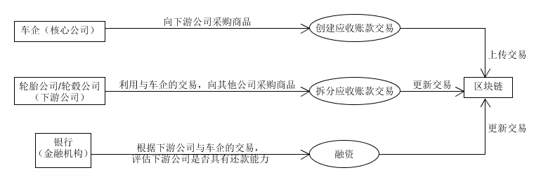  

- 核心功能介绍  
    - 功能1:采购商品，创建应收账款交易  
        只允许核心企业直接创建应收账款交易，这也是供应链中的第一笔交易。
        ```solidity
        //1. 商品采购
        function createReceipt(address _to, string memory _goods, uint _amount) public returns (uint receiptid) {
            address _from = msg.sender;
            require(
                _from == kernelCompany,
                "Only kernel company can create receipt"
            );
            require(
                _to != _from,
                "To and From can not be the same."
            );
            receipts.push(Receipt({
                from: _from,
                to: _to,
                goods: _goods,
                amount: _amount,
                id: receiptId,
                receiptStatus: ReceiptStatus.unconfirmed
            }));
            receiptId += 1;
            return receiptId-1;
        }
        ```

    - 功能2:应收账款转让  
        只允许下游公司进行应收账款转让。如果全额转让，就将交易的收款人直接改成转让对象；如果只转移一部分，就修改原交易的数额，并创建另一个交易，记录核心企业与转让对象之间的交易。在上一次作业中忘记在拆分前判断应收账款交易是否是未还清的，这里做了改正。
        ```solidity
        //2. 应收账款转让
        function divideReceipt(address _to, string memory _goods, uint _amount) public returns (uint receiptid) {
            address _from = msg.sender;
            require(
                (_from != kernelCompany && companies[_from].companyType == CompanyType.manufacturer),
                "Only manufacturer (except kernel company) can divide receipt."
            );
            require(
                _to != _from,
                "To and From can not be the same."
            );
            for(uint i = 0; i < receipts.length; i++) {
                if(receipts[i].to == _from && receipts[i].receiptStatus != ReceiptStatus.paid) {
                    require(
                        receipts[i].amount >= _amount,
                        "The amount is too large."
                    );
                    receipts[i].amount -= _amount;
                    if(receipts[i].amount == 0) {
                        receipts[i].to = _to;
                        return receipts[i].id;
                    }
                    else {
                        receipts.push(Receipt({
                            from: receipts[i].from,
                            to: _to,
                            goods: _goods,
                            amount: _amount,
                            id: receiptId,
                            receiptStatus: receipts[i].receiptStatus
                        }));
                        receiptId += 1;
                        return receiptId-1;
                    }
                }
            }
            return 0;
        }
        ```

    - 功能3:利用应收账款向银行融资  
        下游企业向银行融资的前提是，核心公司与其有应收账款交易，并且金额大于等于融资的金额。若能进行融资，则与应收账款转让的结果类似，记录核心企业与银行之间的交易。
        ```solidity
        //3. 利用应收账款向金融机构融资
        function financing(address _from, uint _amount) public returns (uint receiptid) {
            address _to = msg.sender;
            require(
                companies[_to].companyType == CompanyType.financialInstitution || _to == issuer,
                "Company can only financing from financial institution or central bank."
            );
            require(
                _to != _from,
                "To and From can not be the same."
            );
            for(uint i = 0; i < receipts.length; i++) {
                if(receipts[i].to == _from && receipts[i].receiptStatus != ReceiptStatus.paid) {
                    require(
                        receipts[i].amount >= _amount,
                        "The amount is too large."
                    );
                    receipts[i].amount -= _amount;
                    if(receipts[i].amount == 0) {
                        receipts[i].amount = _amount;
                        receipts[i].to = _to;
                        balances[_from] += _amount;
                        return receipts[i].id;
                    }
                    else {
                        receipts.push(Receipt({
                            from: receipts[i].from,
                            to: _to,
                            goods: "",
                            amount: _amount,
                            id: receiptId,
                            receiptStatus: receipts[i].receiptStatus
                        }));
                        receiptId += 1;
                        balances[_from] += _amount;
                        return receiptId-1;
                    }
                }
            }
            return 0;
        }
        ```

    - 功能4:应收账款支付结算  
        在这条供应链中，最终只有核心企业会欠其他人钱，所以只需核心企业调用支付结算，按照交易结算给目标即可。
        ```solidity
        //4. 应收账款结算
        function settleAccounts() public returns (bool success) {
            address cur = msg.sender;
            require(
                cur == kernelCompany,
                "Only kernel company can settle accounts."
            );
            for(uint i = 0; i < receipts.length; i++) {
                require(
                        receipts[i].from == kernelCompany,
                        "From of the receipt is not kernel company."
                );
                if (receipts[i].receiptStatus == ReceiptStatus.paid) {
                    continue;
                }
                balances[kernelCompany] -= receipts[i].amount;
                balances[receipts[i].to] += receipts[i].amount;
                receipts[i].receiptStatus = ReceiptStatus.paid;
            }
            return true;
        }
        ```

## 三、功能测试
### 1.初始化核心公司为车企
  
  

### 2.银行向车企发放 1000 万
  
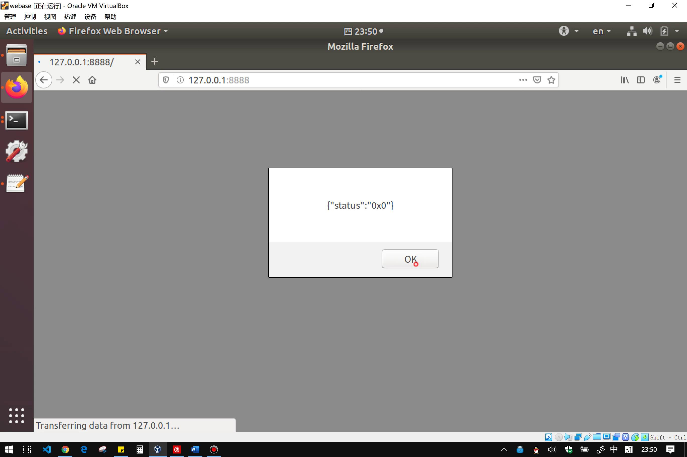  
- 查询车企余额，为 1000(0x3e8) 万  
      
      


### 3.车企向轮胎公司采购 500 万元轮胎
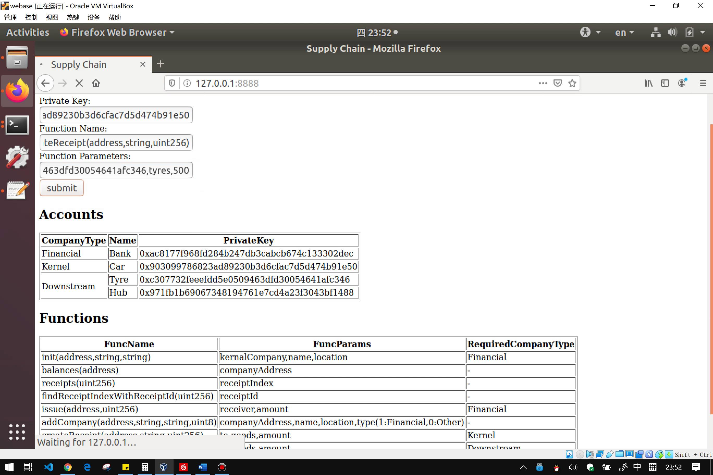  
  

### 4.轮胎公司通过拆分交易的方式，向轮毂公司采购 200 万元轮毂
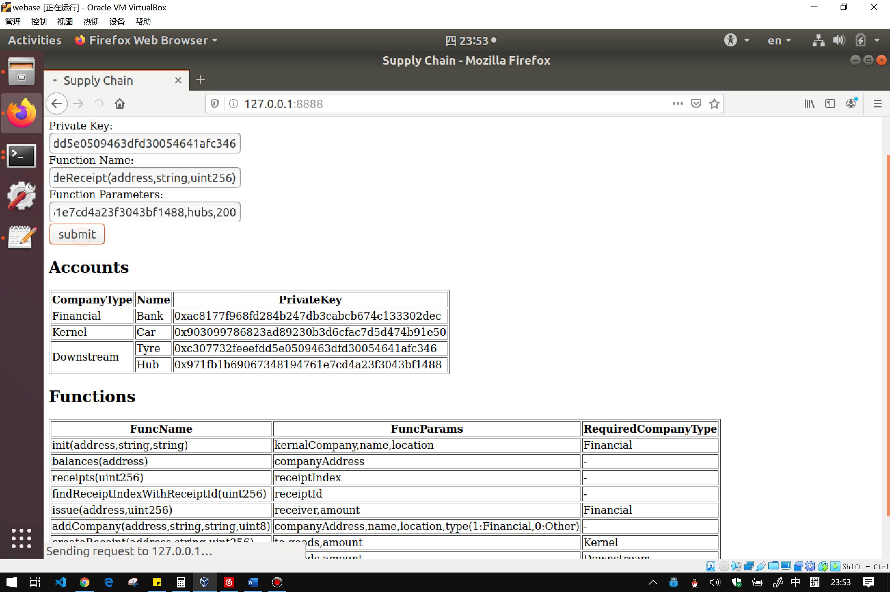  
  

### 5.轮毂公司利用与车企的交易，向银行融资 100 万
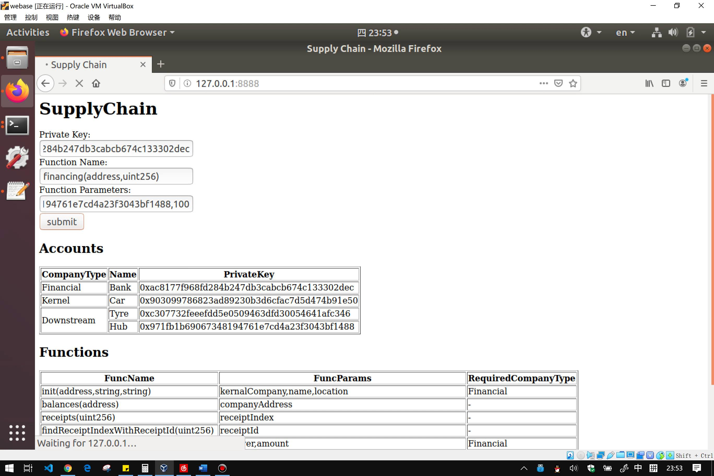  
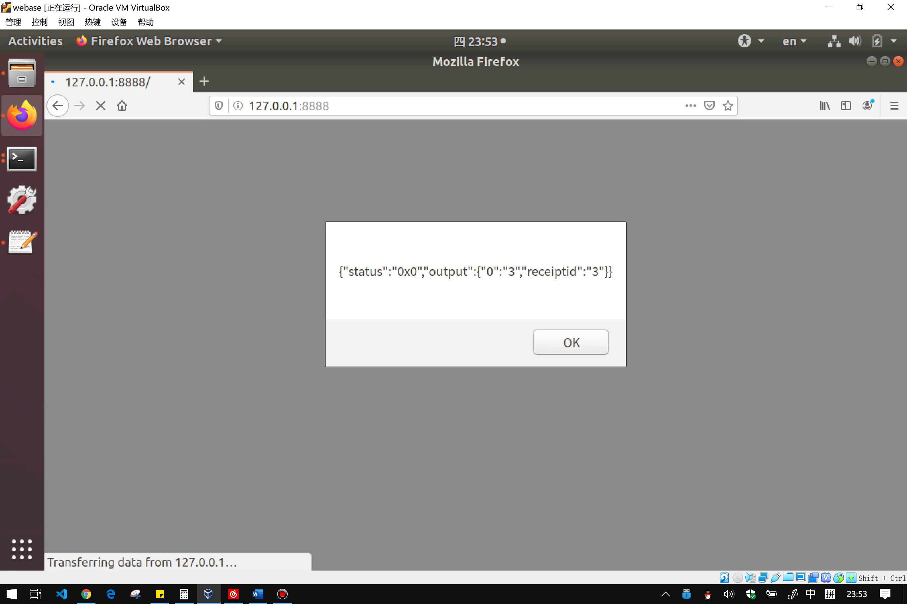  
- 查询轮毂公司余额，为 100(0x64) 万  
      
      

### 6.车企结算所有交易
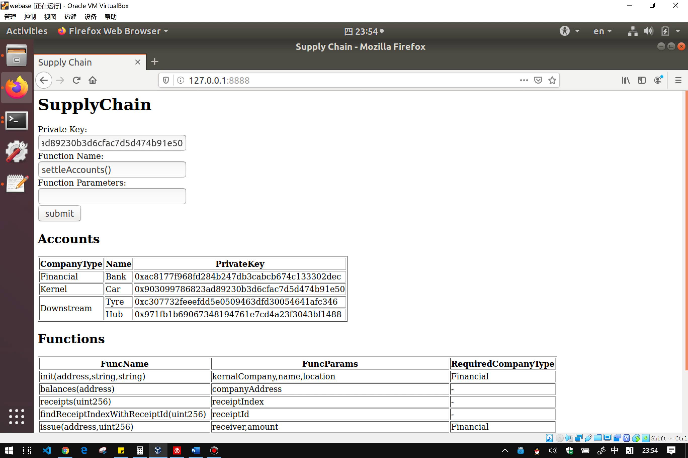  
  

### 7.查询余额
- 车企   
      
    余额为 500(0x1f4) 万  
      
- 轮胎公司  
    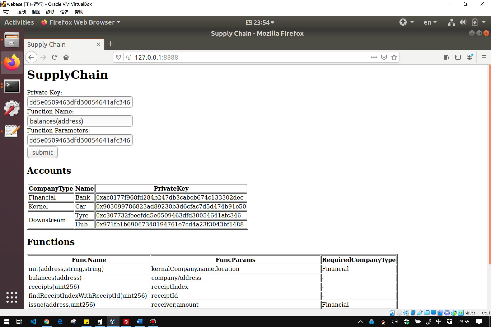  
    余额为 300(0x12c) 万  
      
- 轮毂公司  
    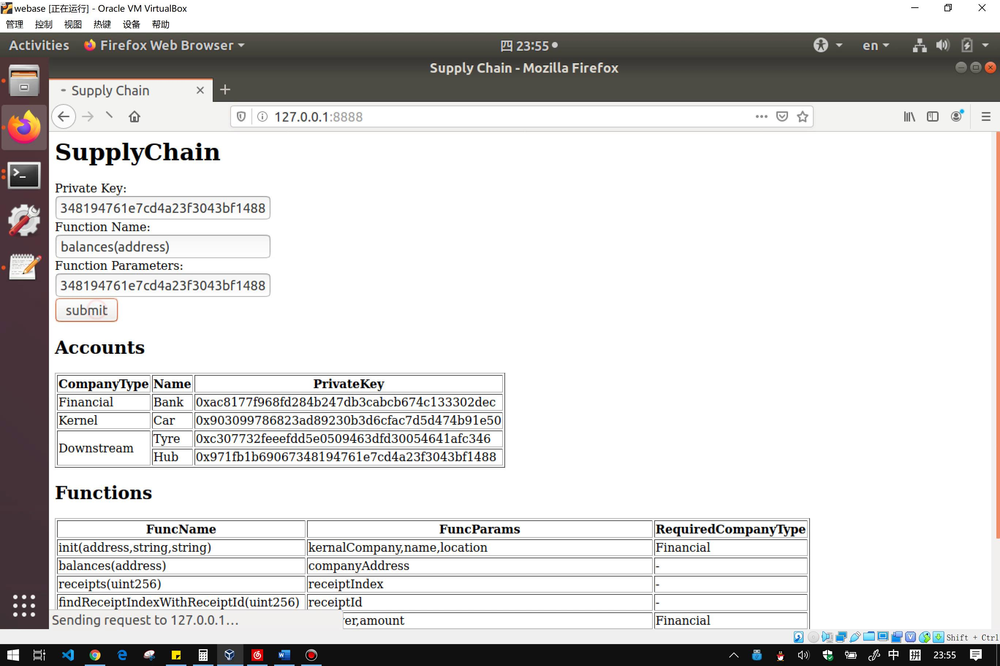  
    余额为 200(0xc8) 万  
      

## 四、界面展示
### 前端设计
- 代码文件路径  
    mybase/index.html

- 界面
    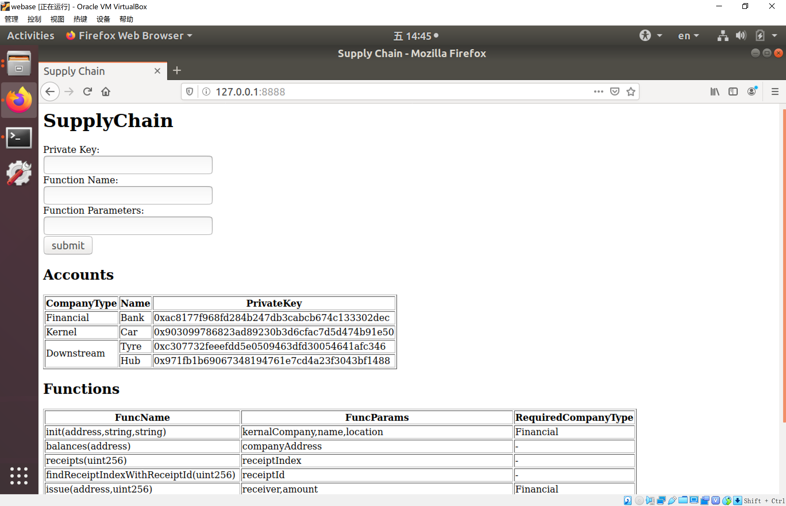  

- 提供给用户的输入主要就是三个，前两个可以从页面下方提供的表格中查找复制，点击 submit 将会向服务器发起一个 post 请求。
    - 调用者的私钥 Private Key
    - 调用的函数 Function Name
    - 函数传入的参数 Function Parameters  

- 使用实例
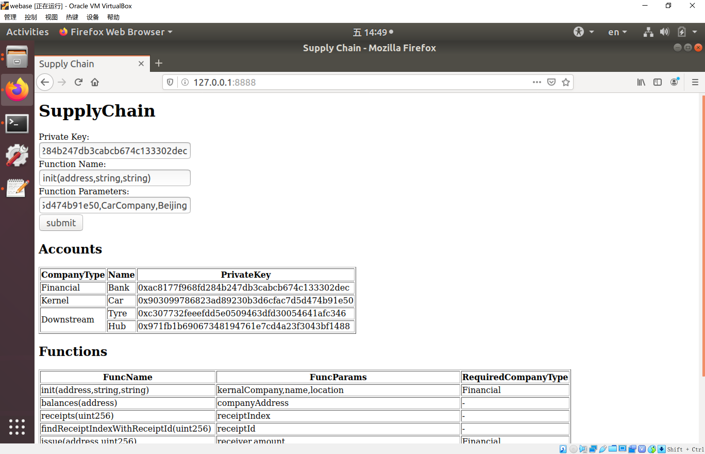

### 后端设计
- 代码文件路径  
    mybase/server.js
- 基本思路
    - 先根据请求中的 privateKey ，修改全局配置，使 privateKey 指定的账户成为调用者。
    - 将传入的 funcName 和 funcParams 做一些解析，使其满足 sendRawTransaction 的参数的格式，然后调用 sendRawTransaction 执行交易。
    - 解析交易返回的结果，通过 alert 的方式显示在网页上。

- 关键代码
    - 在服务器运行时修改全局配置
        我的做法是为每个账户写了一个 config.json ，每个 config.json 只有 privateKey 的值是不同的。在 Configuration.setConfig 中传入账户对应的配置文件。
        需要注意的是，这之后还要调用 web3jService 和 cnsService 等类的 resetConfig 函数，否则调用 sendRawTransaction 时，交易的执行者不会更新。
        ```js
        function switchToAccount (address) {
            for (let item of configs) {
                if (item.privateKey == address) {
                    Configuration.reset();
                    Configuration.setConfig(path.join(__dirname, item.configPath));
                    api.resetConfig();
                    cns.resetConfig();
                    console.log("switch account to "+item.name);
                    return;
                }
            }
        }
        ```
    - 执行交易 sendRawTransaction
        通过查看源代码，得知这个函数的参数中的合约函数名的格式应为类似 "init(address,string,string)" ，合约函数参数得是一个数组。

    - 解析交易结果
        关键是用到 utils.decodeMethod 。这个函数要求传入合约函数的 ABI，ABI 可以通过 cns.queryCnsByNameAndVersion 来获取。
        ```js
        api.sendRawTransaction(contractAddress, body.funcName, params).then(result => {
            console.log(result);
            let status = result.status;
            let ret = {
                status: status
            };
            let output = result.output;
            if (output !== '0x') {
                ret.output = utils.decodeMethod(getItemFromABIByName(fName), output);
            }
            console.log(ret);
            var retString = JSON.stringify(ret);
            response.write('<script>alert(\'');
            response.write(retString);
            response.write('\')</script>');
            let data = fs.readFileSync('./index.html','utf-8');
            response.write(data);
            response.end();
        });
        ```

## 五、心得体会
这次实验花了很多时间在搞清楚 api 如何调用上，官网的文档有限，主要讲了配置和 api 总览，
因此需要通过 nodejs-sdk 中附带的 cli 程序的实现来学习 api 的调用。在部署 SupplyChain 前，部署了很多个版本的 HelloWorld 合约进行测试。
等到把几乎所有会用的 api 都弄懂之后，再部署 SupplyChain 会发现几乎就已经完成了。另外，通过这几次的实验，对供应链金融加区块链的应用的优点更加熟悉了。